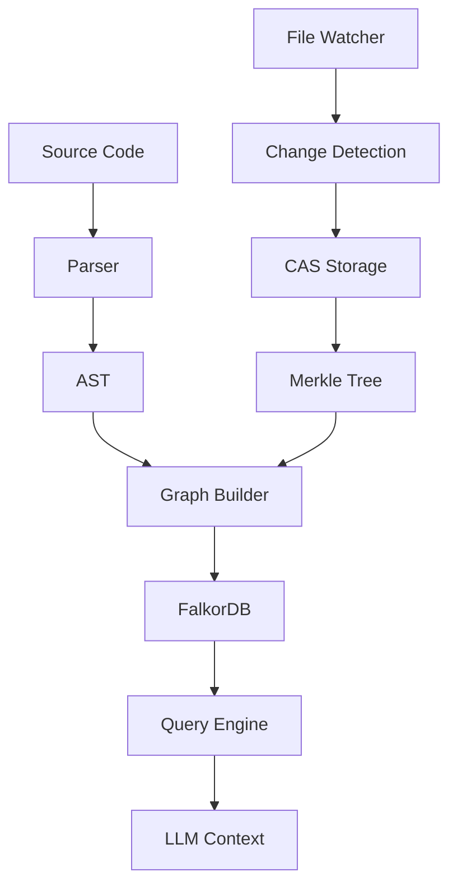

# Architecture Documentation

## Overview

Code Context Graph follows a **Hexagonal Architecture** pattern with clear separation of concerns between domain logic, application services, and infrastructure.

## Core Components

### Domain Layer (`crates/core`)
- **Types**: Core domain entities and value objects
- **Error Handling**: Centralized error types
- **Hashing**: Content-addressable identifiers
- **Configuration**: Application settings

### Application Layer
- **Parser** (`crates/parser`): Tree-sitter integration for AST generation
- **Graph** (`crates/graph`): Graph construction and querying
- **Connascence** (`crates/connascence`): Coupling analysis
- **AASE** (`crates/aase`): Context engineering

### Infrastructure Layer
- **Storage** (`crates/storage`): CAS + Merkle tree persistence
- **Watcher** (`crates/watcher`): File system monitoring
- **API** (`crates/api`): REST endpoints and serialization

### Interface Layer
- **CLI** (`crates/cli`): Command-line interface

## Data Flow

## Key Design Decisions

### Content-Addressable Storage (CAS)
- **Why**: Efficient deduplication and integrity verification
- **Implementation**: Blake3 hashing with sled storage
- **Benefits**: 85%+ storage reduction, built-in versioning

### Merkle Trees
- **Why**: Efficient change detection and history
- **Implementation**: Tree structure with content hashes
- **Benefits**: O(log n) diff computation, immutable history

### Event-Driven Architecture
- **File Changes**: Debounced events with batch processing
- **Graph Updates**: Incremental updates only for changed nodes
- **API Updates**: WebSocket notifications for real-time clients

## Performance Considerations

### Memory Management
- Stream processing for large files
- Lazy loading of graph components
- LRU caches for frequently accessed data

### Concurrency
- Tokio async runtime for I/O operations
- Rayon for CPU-intensive parallel processing
- Lock-free data structures where possible

### Scalability
- Partitioned storage for large codebases
- Configurable batch sizes
- Resource-aware processing limits

## Security

### Input Validation
- File size limits
- Path traversal protection
- Content type verification

### Storage Security
- Hash integrity verification
- Read-only CAS entries
- Configurable access controls

## Extension Points

### Language Support
- Tree-sitter parser integration
- Language-specific AST visitors
- Custom relation extractors

### Analysis Modules
- Pluggable quality metrics
- Custom connascence detectors
- Domain-specific analyzers

### Storage Backends
- Swappable CAS implementations
- Multiple graph database support
- Cloud storage adapters