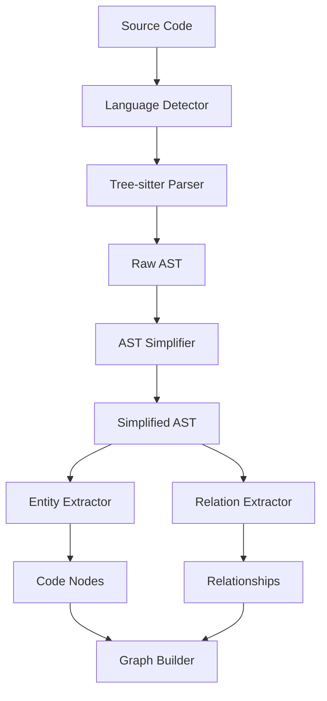

# Parser Implementation Guide

## Overview

The parser subsystem is responsible for converting source code into an Abstract Syntax Tree (AST) and extracting semantic relationships. It uses Tree-sitter for efficient, incremental parsing and supports multiple programming languages.

## Architecture



## Language Support

### Supported Languages

| Language   | Parser Version | Features Supported |
|------------|----------------|-------------------|
| Python     | 0.20.4        | Functions, Classes, Imports, Decorators |
| JavaScript | 0.20.1        | Functions, Classes, Modules, Async/Await |
| Java       | 0.20.2        | Classes, Methods, Packages, Inheritance |
| Kotlin     | 0.3.1         | Classes, Functions, Coroutines, Extensions |

### Language Detection

The system automatically detects languages using multiple strategies:

```rust
#[derive(Debug, Clone, PartialEq)]
pub enum Language {
    Python,
    JavaScript,
    Java,
    Kotlin,
    Unknown,
}

pub struct LanguageDetector;

impl LanguageDetector {
    pub fn detect(path: &Path, content: Option<&str>) -> Language {
        // 1. File extension
        if let Some(ext) = path.extension() {
            match ext.to_str() {
                Some("py") => return Language::Python,
                Some("js") | Some("mjs") => return Language::JavaScript,
                Some("java") => return Language::Java,
                Some("kt") | Some("kts") => return Language::Kotlin,
                _ => {}
            }
        }
        
        // 2. Shebang line
        if let Some(content) = content {
            if content.starts_with("#!/usr/bin/env python") {
                return Language::Python;
            }
        }
        
        // 3. Content-based heuristics
        if let Some(content) = content {
            if content.contains("def ") && content.contains(":") {
                return Language::Python;
            }
            if content.contains("function ") || content.contains("=>") {
                return Language::JavaScript;
            }
            if content.contains("class ") && content.contains("{") {
                return Language::Java; // or Kotlin, needs refinement
            }
        }
        
        Language::Unknown
    }
}
```

## Tree-sitter Integration

### Parser Registry

The parser registry manages Tree-sitter parsers for different languages:

```rust
use tree_sitter::{Language, Parser};
use std::collections::HashMap;

pub struct ParserRegistry {
    parsers: HashMap<crate::Language, Parser>,
}

impl ParserRegistry {
    pub fn new() -> Result<Self> {
        let mut registry = Self {
            parsers: HashMap::new(),
        };
        
        registry.register_language(crate::Language::Python, tree_sitter_python::language())?;
        registry.register_language(crate::Language::JavaScript, tree_sitter_javascript::language())?;
        registry.register_language(crate::Language::Java, tree_sitter_java::language())?;
        registry.register_language(crate::Language::Kotlin, tree_sitter_kotlin::language())?;
        
        Ok(registry)
    }
    
    fn register_language(&mut self, lang: crate::Language, ts_lang: Language) -> Result<()> {
        let mut parser = Parser::new();
        parser.set_language(ts_lang)?;
        self.parsers.insert(lang, parser);
        Ok(())
    }
    
    pub fn parse(&mut self, language: crate::Language, content: &str) -> Result<tree_sitter::Tree> {
        let parser = self.parsers.get_mut(&language)
            .ok_or_else(|| ParseError::UnsupportedLanguage(language))?;
        
        parser.parse(content, None)
            .ok_or(ParseError::ParseFailed)
    }
}
```

### Incremental Parsing

Tree-sitter supports incremental parsing for performance:

```rust
pub struct IncrementalParser {
    registry: ParserRegistry,
    file_trees: HashMap<PathBuf, (tree_sitter::Tree, String)>,
}

impl IncrementalParser {
    pub async fn parse_or_update(&mut self, path: &Path, content: &str) -> Result<tree_sitter::Tree> {
        let language = LanguageDetector::detect(path, Some(content));
        
        if let Some((old_tree, old_content)) = self.file_trees.get(path) {
            // Compute the diff and reuse parts of the old tree
            let changes = compute_text_changes(old_content, content);
            if changes.is_empty() {
                return Ok(old_tree.clone());
            }
            
            // Apply changes incrementally
            let mut new_tree = old_tree.clone();
            for change in changes {
                new_tree.edit(&change);
            }
            
            let updated_tree = self.registry.parse(language, content)?;
            self.file_trees.insert(path.to_path_buf(), (updated_tree.clone(), content.to_string()));
            Ok(updated_tree)
        } else {
            // First time parsing this file
            let tree = self.registry.parse(language, content)?;
            self.file_trees.insert(path.to_path_buf(), (tree.clone(), content.to_string()));
            Ok(tree)
        }
    }
}
```

## AST Simplification

The raw Tree-sitter AST is simplified into a more manageable form:

### Simplified AST Structure

```rust
#[derive(Debug, Clone, Serialize, Deserialize)]
pub struct SimplifiedAST {
    pub root: ASTNode,
    pub language: Language,
    pub file_path: PathBuf,
}

#[derive(Debug, Clone, Serialize, Deserialize)]
pub struct ASTNode {
    pub id: NodeId,
    pub node_type: NodeType,
    pub name: Option<String>,
    pub range: Range,
    pub children: Vec<ASTNode>,
    pub metadata: HashMap<String, serde_json::Value>,
}

#[derive(Debug, Clone, Serialize, Deserialize)]
pub enum NodeType {
    Module,
    Class,
    Function,
    Method,
    Variable,
    Import,
    Call,
    Parameter,
    ReturnType,
    Decorator,
    Comment,
    Unknown(String),
}

#[derive(Debug, Clone, Serialize, Deserialize)]
pub struct Range {
    pub start_line: u32,
    pub start_column: u32,
    pub end_line: u32,
    pub end_column: u32,
}
```

### Language-Specific Simplifiers

Each language has its own AST simplifier:

```rust
pub trait ASTSimplifier {
    fn simplify(&self, tree: &tree_sitter::Tree, content: &str) -> Result<SimplifiedAST>;
}

pub struct PythonSimplifier;

impl ASTSimplifier for PythonSimplifier {
    fn simplify(&self, tree: &tree_sitter::Tree, content: &str) -> Result<SimplifiedAST> {
        let mut walker = tree.walk();
        let root_node = tree.root_node();
        
        let simplified_root = self.simplify_node(&root_node, content, &mut walker)?;
        
        Ok(SimplifiedAST {
            root: simplified_root,
            language: Language::Python,
            file_path: PathBuf::new(), // Set by caller
        })
    }
}

impl PythonSimplifier {
    fn simplify_node(
        &self,
        node: &tree_sitter::Node,
        content: &str,
        walker: &mut tree_sitter::TreeCursor,
    ) -> Result<ASTNode> {
        let node_type = match node.kind() {
            "module" => NodeType::Module,
            "class_definition" => NodeType::Class,
            "function_definition" => NodeType::Function,
            "import_statement" | "import_from_statement" => NodeType::Import,
            "call" => NodeType::Call,
            "decorated_definition" => NodeType::Decorator,
            kind => NodeType::Unknown(kind.to_string()),
        };
        
        let name = self.extract_name(node, content);
        let range = Range {
            start_line: node.start_position().row as u32,
            start_column: node.start_position().column as u32,
            end_line: node.end_position().row as u32,
            end_column: node.end_position().column as u32,
        };
        
        let mut children = Vec::new();
        let mut child_cursor = node.walk();
        
        for child in node.children(&mut child_cursor) {
            if self.should_include_child(&child) {
                children.push(self.simplify_node(&child, content, walker)?);
            }
        }
        
        let metadata = self.extract_metadata(node, content);
        
        Ok(ASTNode {
            id: self.generate_node_id(node, content),
            node_type,
            name,
            range,
            children,
            metadata,
        })
    }
    
    fn extract_name(&self, node: &tree_sitter::Node, content: &str) -> Option<String> {
        match node.kind() {
            "class_definition" | "function_definition" => {
                // Find the identifier child
                let mut cursor = node.walk();
                for child in node.children(&mut cursor) {
                    if child.kind() == "identifier" {
                        return Some(child.utf8_text(content.as_bytes()).unwrap().to_string());
                    }
                }
            }
            "import_statement" => {
                // Extract imported module name
                if let Ok(text) = node.utf8_text(content.as_bytes()) {
                    if let Some(module) = text.strip_prefix("import ") {
                        return Some(module.trim().to_string());
                    }
                }
            }
            _ => {}
        }
        None
    }
    
    fn extract_metadata(&self, node: &tree_sitter::Node, content: &str) -> HashMap<String, serde_json::Value> {
        let mut metadata = HashMap::new();
        
        match node.kind() {
            "function_definition" => {
                metadata.insert("async".to_string(), json!(self.is_async_function(node)));
                metadata.insert("parameters".to_string(), json!(self.extract_parameters(node, content)));
                metadata.insert("return_type".to_string(), json!(self.extract_return_type(node, content)));
            }
            "class_definition" => {
                metadata.insert("bases".to_string(), json!(self.extract_base_classes(node, content)));
                metadata.insert("decorators".to_string(), json!(self.extract_decorators(node, content)));
            }
            _ => {}
        }
        
        metadata
    }
}
```

## Entity Extraction

### Visitor Pattern

The system uses the visitor pattern to extract different types of entities:

```rust
pub trait ASTVisitor<T> {
    fn visit(&mut self, node: &ASTNode) -> Result<Vec<T>>;
}

pub struct EntityExtractor {
    language: Language,
}

impl ASTVisitor<CodeNode> for EntityExtractor {
    fn visit(&mut self, node: &ASTNode) -> Result<Vec<CodeNode>> {
        let mut entities = Vec::new();
        
        match node.node_type {
            NodeType::Class => {
                entities.push(self.create_class_node(node)?);
            }
            NodeType::Function | NodeType::Method => {
                entities.push(self.create_function_node(node)?);
            }
            NodeType::Import => {
                entities.extend(self.create_import_nodes(node)?);
            }
            _ => {}
        }
        
        // Recursively visit children
        for child in &node.children {
            entities.extend(self.visit(child)?);
        }
        
        Ok(entities)
    }
}

impl EntityExtractor {
    fn create_class_node(&self, node: &ASTNode) -> Result<CodeNode> {
        Ok(CodeNode {
            id: node.id.clone(),
            node_type: CodeNodeType::Class,
            name: node.name.clone().unwrap_or_default(),
            language: self.language.clone(),
            file_path: "".to_string(), // Set by caller
            line_range: (node.range.start_line, node.range.end_line),
            metadata: node.metadata.clone(),
        })
    }
    
    fn create_function_node(&self, node: &ASTNode) -> Result<CodeNode> {
        let mut metadata = node.metadata.clone();
        
        // Add function-specific metadata
        metadata.insert("complexity".to_string(), json!(self.calculate_complexity(node)));
        metadata.insert("parameters".to_string(), json!(self.extract_parameter_names(node)));
        
        Ok(CodeNode {
            id: node.id.clone(),
            node_type: CodeNodeType::Function,
            name: node.name.clone().unwrap_or_default(),
            language: self.language.clone(),
            file_path: "".to_string(), // Set by caller
            line_range: (node.range.start_line, node.range.end_line),
            metadata,
        })
    }
}
```

## Relationship Extraction

### Relation Types

The system extracts various types of relationships:

```rust
#[derive(Debug, Clone, Serialize, Deserialize)]
pub enum RelationType {
    Contains,      // File -> Module, Class -> Method
    Imports,       // Module -> Module
    Extends,       // Class -> Class
    Implements,    // Class -> Interface
    Calls,         // Function -> Function
    References,    // Any -> Variable
    Returns,       // Function -> Type
    Parameter,     // Function -> Type
    Instantiates,  // Function -> Class
    Uses,          // Generic usage
    Decorates,     // Decorator -> Function/Class
}

pub struct RelationExtractor {
    language: Language,
}

impl ASTVisitor<Relationship> for RelationExtractor {
    fn visit(&mut self, node: &ASTNode) -> Result<Vec<Relationship>> {
        let mut relations = Vec::new();
        
        match node.node_type {
            NodeType::Call => {
                relations.extend(self.extract_call_relations(node)?);
            }
            NodeType::Class => {
                relations.extend(self.extract_inheritance_relations(node)?);
            }
            NodeType::Import => {
                relations.extend(self.extract_import_relations(node)?);
            }
            _ => {}
        }
        
        // Recursively visit children
        for child in &node.children {
            relations.extend(self.visit(child)?);
        }
        
        Ok(relations)
    }
}
```

## Performance Optimizations

### Parallel Processing

Large codebases are processed in parallel:

```rust
use rayon::prelude::*;

pub struct ParallelParser {
    registry: Arc<Mutex<ParserRegistry>>,
}

impl ParallelParser {
    pub async fn parse_files(&self, files: Vec<PathBuf>) -> Result<Vec<ParseResult>> {
        let results: Result<Vec<_>, _> = files
            .into_par_iter()
            .map(|path| {
                let content = std::fs::read_to_string(&path)?;
                let language = LanguageDetector::detect(&path, Some(&content));
                
                let mut registry = self.registry.lock().unwrap();
                let tree = registry.parse(language, &content)?;
                drop(registry);
                
                let simplifier = self.get_simplifier(language);
                let ast = simplifier.simplify(&tree, &content)?;
                
                Ok(ParseResult {
                    file_path: path,
                    ast,
                    language,
                })
            })
            .collect();
        
        results
    }
}
```

### Memory Management

The parser implements streaming for large files:

```rust
pub struct StreamingParser {
    chunk_size: usize,
}

impl StreamingParser {
    pub async fn parse_large_file(&self, path: &Path) -> Result<SimplifiedAST> {
        let file = File::open(path).await?;
        let mut reader = BufReader::new(file);
        let mut buffer = String::new();
        
        // Read file in chunks to avoid loading everything into memory
        let mut chunks = Vec::new();
        loop {
            buffer.clear();
            let bytes_read = reader.read_to_string(&mut buffer).await?;
            if bytes_read == 0 {
                break;
            }
            
            chunks.push(buffer.clone());
            
            if buffer.len() > self.chunk_size {
                // Process chunk and clear memory
                self.process_chunk(&buffer)?;
                buffer.clear();
            }
        }
        
        // Combine results from all chunks
        self.combine_chunk_results(chunks)
    }
}
```

## Error Handling

### Parse Errors

The parser provides detailed error information:

```rust
#[derive(Debug, Error)]
pub enum ParseError {
    #[error("Unsupported language: {0:?}")]
    UnsupportedLanguage(Language),
    
    #[error("Failed to parse file: {file}")]
    ParseFailed { file: PathBuf },
    
    #[error("Invalid syntax at line {line}, column {column}: {message}")]
    SyntaxError { line: u32, column: u32, message: String },
    
    #[error("IO error: {0}")]
    Io(#[from] std::io::Error),
    
    #[error("Tree-sitter error: {0}")]
    TreeSitter(String),
}

impl ParseError {
    pub fn with_location(mut self, file: PathBuf, line: u32, column: u32) -> Self {
        match &mut self {
            ParseError::SyntaxError { .. } => self,
            _ => ParseError::SyntaxError {
                line,
                column,
                message: self.to_string(),
            }
        }
    }
}
```

## Testing

### Unit Tests

Each parser component has comprehensive unit tests:

```rust
#[cfg(test)]
mod tests {
    use super::*;
    
    #[tokio::test]
    async fn test_python_function_parsing() {
        let code = r#"
def hello_world(name: str) -> str:
    """Say hello to someone."""
    return f"Hello, {name}!"
        "#;
        
        let mut registry = ParserRegistry::new().unwrap();
        let tree = registry.parse(Language::Python, code).unwrap();
        
        let simplifier = PythonSimplifier;
        let ast = simplifier.simplify(&tree, code).unwrap();
        
        assert_eq!(ast.language, Language::Python);
        assert_eq!(ast.root.children.len(), 1);
        
        let function_node = &ast.root.children[0];
        assert_eq!(function_node.node_type, NodeType::Function);
        assert_eq!(function_node.name, Some("hello_world".to_string()));
    }
    
    #[test]
    fn test_language_detection() {
        assert_eq!(
            LanguageDetector::detect(Path::new("test.py"), None),
            Language::Python
        );
        
        assert_eq!(
            LanguageDetector::detect(Path::new("test.js"), None),
            Language::JavaScript
        );
        
        let python_code = "def main():\n    pass";
        assert_eq!(
            LanguageDetector::detect(Path::new("script"), Some(python_code)),
            Language::Python
        );
    }
}
```

### Integration Tests

Integration tests verify end-to-end parsing:

```rust
#[tokio::test]
async fn test_full_parsing_pipeline() {
    let temp_dir = tempfile::tempdir().unwrap();
    let file_path = temp_dir.path().join("test.py");
    
    std::fs::write(&file_path, r#"
class Calculator:
    def add(self, a: int, b: int) -> int:
        return a + b
    
    def multiply(self, a: int, b: int) -> int:
        return self.add(a, 0) * b
    "#).unwrap();
    
    let mut parser = ParallelParser::new().await.unwrap();
    let results = parser.parse_files(vec![file_path]).await.unwrap();
    
    assert_eq!(results.len(), 1);
    let result = &results[0];
    
    // Verify entities were extracted
    let entity_extractor = EntityExtractor::new(Language::Python);
    let entities = entity_extractor.visit(&result.ast.root).unwrap();
    
    assert_eq!(entities.len(), 3); // Calculator class + 2 methods
    
    // Verify relationships were extracted
    let relation_extractor = RelationExtractor::new(Language::Python);
    let relations = relation_extractor.visit(&result.ast.root).unwrap();
    
    assert!(!relations.is_empty());
}
```

## Configuration

### Parser Configuration

```rust
#[derive(Debug, Clone, Serialize, Deserialize)]
pub struct ParserConfig {
    pub max_file_size: u64,
    pub timeout_ms: u64,
    pub enable_incremental: bool,
    pub parallel_workers: usize,
    pub supported_languages: Vec<Language>,
    pub ignore_patterns: Vec<String>,
    pub custom_parsers: HashMap<String, String>,
}

impl Default for ParserConfig {
    fn default() -> Self {
        Self {
            max_file_size: 10 * 1024 * 1024, // 10MB
            timeout_ms: 30_000, // 30 seconds
            enable_incremental: true,
            parallel_workers: num_cpus::get(),
            supported_languages: vec![
                Language::Python,
                Language::JavaScript,
                Language::Java,
                Language::Kotlin,
            ],
            ignore_patterns: vec![
                "*.min.js".to_string(),
                "*_test.py".to_string(),
                "*.spec.js".to_string(),
            ],
            custom_parsers: HashMap::new(),
        }
    }
}
```

## Extending Language Support

### Adding a New Language

To add support for a new language:

1. **Add language to enum**:
```rust
#[derive(Debug, Clone, PartialEq)]
pub enum Language {
    Python,
    JavaScript,
    Java,
    Kotlin,
    Rust, // New language
    Unknown,
}
```

2. **Update language detector**:
```rust
impl LanguageDetector {
    pub fn detect(path: &Path, content: Option<&str>) -> Language {
        if let Some(ext) = path.extension() {
            match ext.to_str() {
                // ... existing cases
                Some("rs") => return Language::Rust,
                _ => {}
            }
        }
        // ... rest of detection logic
    }
}
```

3. **Create language-specific simplifier**:
```rust
pub struct RustSimplifier;

impl ASTSimplifier for RustSimplifier {
    fn simplify(&self, tree: &tree_sitter::Tree, content: &str) -> Result<SimplifiedAST> {
        // Implement Rust-specific AST simplification
    }
}
```

4. **Register the parser**:
```rust
impl ParserRegistry {
    pub fn new() -> Result<Self> {
        // ... existing registrations
        registry.register_language(Language::Rust, tree_sitter_rust::language())?;
        Ok(registry)
    }
}
```

5. **Add tests**:
```rust
#[test]
fn test_rust_parsing() {
    let code = r#"
fn main() {
    println!("Hello, world!");
}
    "#;
    
    // Test parsing logic
}
```