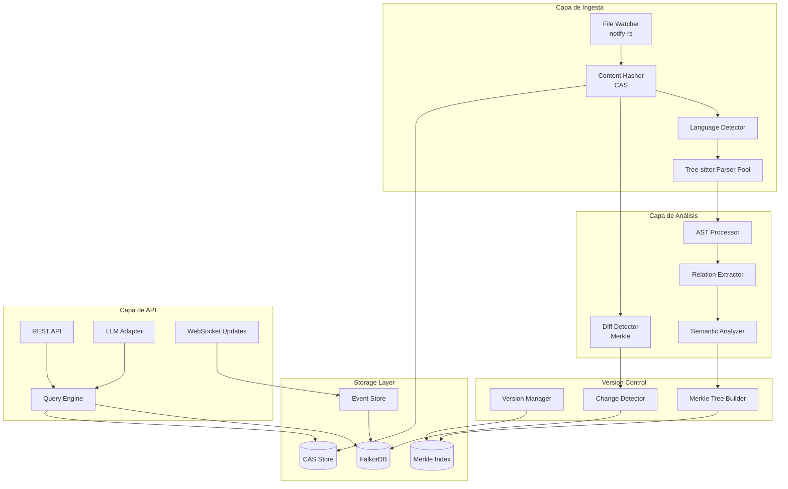

# PRD: Code Graph Engine asistido por LLM
## Sistema de Análisis de Código Multilenguaje con Grafo Semántico y Context Engineering

**Versión:** 1.0  
**Fecha:** Agosto 2025  
**Estado:** Draft

---

## 📋 Resumen Ejecutivo

Code Graph Engine es una herramienta desarrollada en **Rust** que analiza código fuente en múltiples lenguajes de programación (Java, Kotlin, JavaScript, Python), genera un **grafo semántico** con las relaciones clave (llamadas, definiciones, imports, clases), lo almacena en **FalkorDB** y permite que una **LLM (IA generativa)** lo consuma para responder preguntas complejas sobre el sistema, asistir en la navegación del código y generar explicaciones estructuradas.

### Propuesta de Valor

- **Multilenguaje**: Soporte nativo para Java, Kotlin, JavaScript y Python
- **Alta fidelidad semántica**: Representación precisa del código como grafo con nodos y aristas
- **Interfaz LLM-friendly**: Exposición del grafo en formato optimizado para consumo por LLMs
- **Actualización en tiempo real**: Grafo dinámico que se actualiza con cambios en el código
- **Asistente inteligente**: Capacidad de responder preguntas complejas sobre el código

---

## 🧭 Visión del Producto

Desarrollar una herramienta escrita en **Rust** que transforme bases de código en grafos semánticos navegables, permitiendo a las LLMs comprender y razonar sobre sistemas complejos. El producto combina:

1. **Análisis estático avanzado** mediante Tree-sitter con detección de Connascence
2. **Almacenamiento en grafo** con FalkorDB para consultas eficientes
3. **Context engineering** siguiendo principios AASE (Automatización Asistida por IA)
4. **Actualización incremental** para mantener el grafo sincronizado
5. **File watching en tiempo real** para detectar y procesar cambios mientras el desarrollador trabaja
6. **Versionado eficiente** con CAS + Merkle Trees para historia completa sin duplicación
7. **Gestión de conocimiento evolutivo** con cadenas de contexto y refinamiento iterativo

---

## 🎯 Objetivos del Producto

### Objetivos Principales

* **Multilenguaje**: Soportar al menos 4 lenguajes (Java, Kotlin, JavaScript, Python)
* **Alta fidelidad semántica**: Representar el código como grafo con nodos y aristas que capturan relaciones clave
* **Interfaz LLM-friendly**: Exponer el grafo en un formato consultable por una LLM (JSON+metadata, embeddings o GraphQL)
* **Almacenamiento eficiente**: Usar **FalkorDB** para grafo de relaciones entre elementos del código
* **Asistente inteligente**: Permitir que una LLM navegue el grafo y dé respuestas como:
  * ¿Dónde se usa la función `foo()`?
  * ¿Qué clases heredan de `BaseController`?
  * ¿Qué dependencias externas están presentes?
  * ¿Cómo funciona el servicio de login?
  * **¿Qué partes del código tienen alto acoplamiento?**
  * **¿Dónde hay oportunidades de refactoring?**
  * **¿Cuál es la evolución de calidad del módulo X?**

### Objetivos Técnicos de Rendimiento

* El grafo debe representar al menos el **80% de las relaciones** en un repositorio real
* La LLM debe responder correctamente al menos al **70% de preguntas estructurales** sobre el grafo
* Tiempo de análisis **< 10s** para un proyecto de tamaño medio (~500 archivos)
* Actualización incremental en **< 100ms** para cambios individuales
* **Detección de Connascence** con precisión > 90% para tipos estáticos
* **Generación de contexto AASE** automática para cada dominio del sistema

### Objetivos de Calidad de Código

* **Métricas de acoplamiento** calculadas automáticamente para cada módulo
* **Score de cohesión** disponible para refactorizaciones guiadas
* **Cadena de contexto** completa desde dominio hasta código generado
* **Trazabilidad** de decisiones arquitecturales mediante artefactos versionados

---

## 🔨 Requisitos Funcionales

### 3.1 Ingesta de Código

* [x] El sistema debe aceptar como entrada **carpetas de proyectos multilenguaje**
* [x] Cada archivo será analizado mediante **Tree-sitter** y su parser correspondiente
* [x] Se generará una estructura **AST simplificada**
* [ ] Soporte para análisis incremental de cambios
* [ ] Detección automática del lenguaje por extensión y contenido

```rust
// Estructura de entrada
struct ProjectInput {
    root_path: PathBuf,
    included_extensions: Vec<String>, // [".java", ".kt", ".js", ".py"]
    exclude_patterns: Vec<String>,    // ["test", "vendor", "node_modules"]
}
```

### 3.2 Generación de Grafo

* [x] Por cada elemento identificado se creará un `CodeNode`:
  ```rust
  struct CodeNode {
      id: String,
      node_type: NodeType, // Function, Class, Module, File
      name: String,
      language: Language,
      file_path: String,
      line_range: (u32, u32),
      metadata: HashMap<String, Value>,
  }
  ```

* [x] Se detectarán relaciones:
  * [x] `calls` (una función llama a otra)
  * [x] `defines` (una clase define un método)
  * [x] `imports`, `inherits`, `uses`, `returns`, `instantiates`
  
* [x] Los nodos y relaciones se serializarán como comandos `GRAPH.QUERY` de RedisGraph

### 3.3 Almacenamiento en FalkorDB

* [x] Se conectará a una instancia de **FalkorDB** (RedisGraph compatible)
* [x] Los nodos y relaciones se insertarán usando `MERGE` para evitar duplicados
* [x] Se podrá consultar desde CLI o HTTP API
* [ ] Soporte para transacciones y rollback
* [ ] Índices automáticos para queries frecuentes

```cypher
// Ejemplo de inserción
MERGE (f:Function {id: "foo", language: "Python", file: "a.py"})
MERGE (b:Function {id: "bar", language: "Python", file: "a.py"})
MERGE (f)-[:CALLS]->(b)
```

### 3.4 Interfaz para LLM

* [x] Se expondrá un API o serialización (JSON/GraphQL) para que una LLM:
  * [x] Lea el grafo en formato estructurado
  * [x] Navegue el grafo por relación o tipo
  * [x] Reciba contexto relevante basado en consultas
  * [ ] Obtenga resúmenes de componentes

* [ ] Integración con vector store para embedding textual por función o archivo
* [ ] Protocolo de streaming para respuestas largas

#### Ejemplo de respuesta para LLM:
```json
{
  "query": "¿Qué hace la función processPayment?",
  "context": {
    "function": {
      "name": "processPayment",
      "file": "payment_service.py",
      "calls": ["validateCard", "chargeAmount", "sendReceipt"],
      "called_by": ["checkoutOrder", "subscriptionRenewal"],
      "parameters": ["amount", "card_info", "user_id"],
      "description": "Procesa pagos validando tarjeta y ejecutando cargo"
    },
    "related_entities": [...],
    "quality_metrics": {
      "complexity": 8,
      "cohesion": 0.75,
      "coupling": {
        "afferent": 2,
        "efferent": 5,
        "instability": 0.71
      }
    },
    "connascence": [
      {
        "type": "Execution",
        "with": "validateCard",
        "strength": 0.9,
        "description": "validateCard must be called before chargeAmount"
      },
      {
        "type": "Type", 
        "with": "PaymentGateway",
        "strength": 0.4,
        "description": "Both expect CardInfo type structure"
      }
    ],
    "aase_context": {
      "domain": "CTX-payment-domain-v2",
      "model": "MDL-payment-entities-v1",
      "suggestions": "Consider extracting validation to separate service"
    }
  }
}
```

### 3.5 Sistema de Versionado con CAS + Merkle Trees

* [x] **Content-Addressable Storage (CAS)** para almacenar contenido inmutable
  * [x] Cada archivo, función y entidad se identifica por su hash
  * [x] Deduplicación automática de código idéntico
  * [x] Verificación de integridad incluida

* [x] **Árboles Merkle** para versionado eficiente
  * [x] Detección de cambios en O(log n)
  * [x] Historia completa sin duplicación de datos
  * [x] Comparación rápida entre versiones

```rust
// Estructura de versionado
struct CodeVersion {
    merkle_root: Hash,
    timestamp: DateTime,
    parent_version: Option<Hash>,
    changed_files: Vec<FilePath>,
}

// Nodo en el árbol Merkle
struct MerkleNode {
    content_hash: Hash,        // Hash del contenido
    children: Vec<Hash>,       // Hashes de nodos hijos
    node_type: NodeType,       // File, Module, Function, etc.
}
```

### 3.6 File Watching y Detección de Cambios

* [x] **Monitoreo en tiempo real** de cambios en el sistema de archivos
  * [x] Uso de `notify-rs` para detección cross-platform
  * [x] Soporte para FSEvents (macOS), inotify (Linux), ReadDirectoryChangesW (Windows)
  * [x] Debouncing configurable para evitar procesamiento excesivo

* [x] **Procesamiento incremental inteligente**
  * [x] Solo reprocesar archivos modificados usando CAS
  * [x] Actualización quirúrgica del grafo (solo nodos afectados)
  * [x] Batch processing para cambios masivos (git checkout, refactoring)

* [x] **Sincronización continua**
  * [x] El grafo se mantiene actualizado mientras el desarrollador escribe código
  * [x] Detección de cambios en < 50ms desde que se guarda el archivo
  * [x] Queue de eventos para manejar ráfagas de cambios
  * [x] Recuperación automática si se pierde algún evento

```rust
// Configuración de file watching
struct WatchConfig {
    paths: Vec<PathBuf>,
    debounce_ms: u64,          // Default: 100ms
    ignore_patterns: Vec<String>,
    batch_threshold: usize,     // Cambiar a batch si > N archivos
}

// Flujo de detección de cambios
async fn on_file_change(event: FileEvent) {
    let old_hash = cas.get_file_hash(&event.path);
    let new_hash = hash_file(&event.path);
    
    if old_hash != new_hash {
        let changes = detect_ast_changes(old_hash, new_hash);
        update_graph_incrementally(changes).await;
        update_merkle_tree(event.path, new_hash).await;
        notify_llm_context_updated(event.path).await;
    }
}

// Ejemplo de eventos detectados
enum FileEvent {
    Created(PathBuf),
    Modified(PathBuf),
    Deleted(PathBuf),
    Renamed { from: PathBuf, to: PathBuf },
    // Eventos especiales
    BatchStart,  // Muchos cambios detectados
    BatchEnd,    // Fin de cambios masivos
}
```

**Beneficios del File Watching:**
- **Desarrollo fluido**: No hay que ejecutar comandos para actualizar
- **Feedback instantáneo**: LLM siempre tiene contexto actualizado
- **Detección de problemas**: Alertas en tiempo real sobre código problemático
- **Historial automático**: Cada save es una versión en el Merkle tree

---

## 🤖 Requisitos No Funcionales

### Arquitectura y Tecnología

* **Lenguaje base**: Rust (por rendimiento y concurrencia)
* **Parsers**: Tree-sitter (parsing incremental y soporte multilenguaje)
* **DB de grafo**: FalkorDB (RedisGraph compatible, optimizado para GraphRAG)
* **Extensibilidad**: Arquitectura modular para añadir nuevos lenguajes
* **Modularidad**: Separación clara entre análisis, modelo de grafo y backend LLM
* **Portabilidad**: Ejecutable multiplataforma (Linux, macOS, Windows)

### Performance y Escalabilidad

| Métrica | Requisito | Justificación |
|---------|-----------|---------------|
| Tiempo indexación inicial | < 10s para 500 archivos | Experiencia de usuario |
| Tiempo re-indexación (con CAS) | < 0.5s para cambios | Eficiencia Merkle tree |
| Memoria por proyecto | < 2GB para 500k LOC | Viabilidad en desarrollo |
| Latencia de consulta | < 50ms P50, < 200ms P99 | Interactividad |
| Latencia detección cambios | < 50ms | File watching en tiempo real |
| Deduplicación de código | > 85% reducción en storage | CAS automático |
| Concurrencia | 100+ consultas simultáneas | Equipos grandes |
| Tamaño máximo proyecto | 10M LOC | Proyectos enterprise |
| Historial de versiones | 1000+ sin degradación | Merkle trees eficientes |

---

## 📊 Ejemplo de Grafo Generado

```graphql
# Nodos de código
(:Function {id: "foo", language: "Python", file: "services/auth.py"})
(:Function {id: "bar", language: "Python", file: "services/auth.py"})
(:Class {id: "AuthService", language: "Python", file: "services/auth.py"})
(:Module {id: "database", language: "Python", file: "db/connection.py"})

# Nodos de Connascence
(:ConnascenceNode {
    id: "conn_exec_1",
    type: "Execution",
    strength: 0.8,
    entities: ["foo", "bar"],
    impact: "foo() must be called before bar()"
})

(:ConnascenceNode {
    id: "conn_type_1", 
    type: "Type",
    strength: 0.4,
    entities: ["AuthService", "UserController"],
    impact: "Both expect UserDTO type"
})

# Nodos de contexto AASE
(:ContextArtifact {
    id: "CTX-auth-domain-v3",
    type: "Context",
    domain: "authentication"
})

# Relaciones básicas
(:foo)-[:CALLS {line: 45}]->(:bar)
(:AuthService)-[:DEFINES]->(:foo)
(:AuthService)-[:IMPORTS]->(:database)

# Relaciones de Connascence
(:foo)-[:HAS_CONNASCENCE]->(:conn_exec_1)
(:bar)-[:HAS_CONNASCENCE]->(:conn_exec_1)
(:AuthService)-[:HAS_CONNASCENCE]->(:conn_type_1)

# Relaciones de contexto
(:AuthService)-[:DESCRIBED_IN]->(:CTX-auth-domain-v3)
```

### Modelo de Datos Completo

```rust
// Tipos de nodos
enum NodeType {
    File,
    Module,
    Class,
    Interface,
    Function,
    Method,
    Variable,
    Type,
    Enum,
    // Nuevos tipos para análisis de calidad
    ConnascenceNode,
    ContextArtifact,
    QualityMetric,
}

// Tipos de relaciones
enum RelationType {
    Contains,      // File -> Module, Class -> Method
    Imports,       // Module -> Module
    Extends,       // Class -> Class
    Implements,    // Class -> Interface
    Calls,         // Function -> Function
    References,    // Any -> Variable
    Returns,       // Function -> Type
    Parameter,     // Function -> Type
    Instantiates,  // Function -> Class
    Uses,          // Generic usage
    // Relaciones de Connascence
    HasConnascence(ConnascenceType),
    // Relaciones de contexto
    ConsumesContext,
    ProducesContext,
}

// Tipos de Connascence
#[derive(Debug, Clone, Hash)]
enum ConnascenceType {
    // Estática
    Name,        // Mismo nombre en múltiples lugares
    Type,        // Mismo tipo esperado
    Meaning,     // Convención sobre valores
    Position,    // Orden de parámetros
    Algorithm,   // Mismo algoritmo replicado
    // Dinámica
    Execution,   // Orden de ejecución
    Timing,      // Timing crítico
    Values,      // Valores que cambian juntos
    Identity,    // Misma instancia
}

// Nodo de Connascence
#[derive(Node)]
struct ConnascenceNode {
    id: Hash,
    conn_type: ConnascenceType,
    strength: f32,    // 0.0-1.0
    locality: f32,    // Distancia entre componentes
    degree: usize,    // Número de componentes
    entities: Vec<Hash>,
    impact: String,   // Descripción del impacto
}

// Métricas de calidad
#[derive(Metrics)]
struct QualityMetrics {
    cohesion: f32,
    afferent_coupling: usize,  // Fan-in
    efferent_coupling: usize,  // Fan-out
    instability: f32,          // EC/(AC+EC)
    connascence_score: f32,
    maintainability_index: f32,
}

// Estructuras para CAS + Merkle
#[derive(Hash, Serialize, Deserialize)]
struct CASEntry {
    content_hash: Hash,
    content_type: ContentType,
    size: usize,
    created_at: DateTime<Utc>,
}

#[derive(Clone)]
struct MerkleTree {
    root: Hash,
    nodes: HashMap<Hash, MerkleNode>,
    version: u64,
}

struct GraphVersion {
    version_id: Uuid,
    merkle_root: Hash,
    parent_version: Option<Hash>,
    timestamp: DateTime<Utc>,
    author: String,
    change_summary: ChangeSummary,
    quality_delta: QualityDelta, // Cambios en métricas
}

// Sistema de cambios
#[derive(Serialize, Deserialize)]
enum ChangeType {
    FileAdded(PathBuf),
    FileModified(PathBuf, Vec<ASTDiff>),
    FileDeleted(PathBuf),
    EntityAdded(CodeNode),
    EntityModified(Hash, CodeNode),
    EntityDeleted(Hash),
    RelationAdded(Relation),
    RelationDeleted(Relation),
    ConnascenceDetected(ConnascenceNode),
    QualityMetricChanged(MetricChange),
    ContextGenerated(AASEArtifact),
}
```

---

## 📎 Casos de Uso LLM

### Preguntas Estructurales
* "¿Qué clases dependen de DatabaseConnection?"
* "¿Cuáles son todos los endpoints REST en el sistema?"
* "¿Qué funciones pueden modificar el estado del usuario?"

### Generación de Documentación
* "Genera un diagrama de flujo para el proceso de autenticación"
* "Documenta la API de PaymentService"
* "Crea un README para el módulo de notificaciones"

### Refactorización Asistida
* "¿Qué cambios necesito si renombro esta clase?"
* "¿Puedo extraer estas funciones a un nuevo módulo?"
* "Identifica código duplicado en el servicio de usuarios"

### Navegación Semántica
* "Llévame a donde se validan los permisos de admin"
* "Muestra todas las integraciones con servicios externos"
* "¿Dónde se genera el token JWT?"

### Análisis Temporal (con CAS + Merkle)
* "¿Qué cambió en el módulo de auth en el último sprint?"
* "¿Cuándo se introdujo esta dependencia problemática?"
* "Muestra la evolución de la complejidad de PaymentService"

### Desarrollo en Tiempo Real (con File Watching)
* **Auto-actualización**: El grafo se actualiza mientras escribes código
* **Feedback inmediato**: "Esta función que acabas de escribir rompe 3 tests"
* **Sugerencias contextuales**: "Este patrón es similar a AuthService.validate()"
* **Detección de problemas**: "Acabas de crear una dependencia circular"

### Análisis de Calidad con Connascence
* "¿Cuáles son los puntos de acoplamiento más fuertes en el sistema?"
* "Identifica Connascence of Execution entre servicios"
* "¿Qué módulos tienen baja cohesión?"
* "Sugiere refactorizaciones para reducir el acoplamiento"

### Gestión de Contexto AASE
* "Genera el contexto del dominio de pagos"
* "¿Qué artefactos dependen de CTX-auth-v3?"
* "Muestra la cadena de contexto para el caso de uso de login"
* "¿Qué cambios de dominio afectarían a este código?"

---

## 🧪 Métricas de Éxito

### Métricas Técnicas

| Métrica | Objetivo | Cómo Medirla |
|---------|----------|--------------|
| **Cobertura del grafo** | ≥ 80% relaciones | Validación manual en proyectos de prueba |
| **Precisión LLM** | ≥ 70% respuestas correctas | Test suite con preguntas conocidas |
| **Tiempo de análisis** | < 10s (500 archivos) | Benchmarks automatizados |
| **Tiempo re-análisis (CAS)** | < 0.5s cambios | Benchmarks con cambios típicos |
| **Latencia detección cambios** | < 50ms | Monitoring file watcher |
| **Latencia de actualización** | < 100ms | Monitoring en tiempo real |
| **Deduplicación efectiva** | > 80% reducción | Comparación storage con/sin CAS |
| **Uso de memoria** | < 4MB por 1000 nodos | Profiling continuo |
| **Integridad verificable** | 100% hashes válidos | Verificación automática Merkle |
| **Detección Connascence** | > 90% precisión | Validación contra análisis manual |
| **Cohesión promedio** | > 0.7 | Análisis automático de módulos |
| **Instabilidad promedio** | < 0.5 | Métrica de Martin |
| **Contextos AASE generados** | 100% dominios | Cobertura de artefactos |
| **Propagación de cambios** | < 5s | Tiempo de actualización en cadena |

### Métricas de Adopción

| Métrica | Objetivo Mes 6 | Objetivo Año 1 |
|---------|----------------|----------------|
| Usuarios activos | 100 | 1000 |
| Repositorios indexados | 500 | 5000 |
| Consultas/día | 1000 | 20000 |
| Satisfacción (NPS) | > 40 | > 60 |

---

## 🗓 Roadmap de Implementación

### Semana 1-2: Setup y Fundamentos
- [x] Configurar proyecto Rust con workspace
- [x] Integrar Tree-sitter para Python
- [x] Configurar FalkorDB local con Docker
- [ ] Implementar CAS básico con sled
- [ ] Setup file watcher con notify-rs

### Semana 3-4: Parser y AST
- [ ] Generar AST simplificada para Python
- [ ] Extraer funciones, clases, imports
- [ ] Implementar visitor pattern para AST
- [ ] Hasher de contenido para CAS
- [ ] Tests unitarios para parser

### Semana 5-6: Construcción de Grafo y Versionado
- [ ] Diseñar esquema de grafo en FalkorDB
- [ ] Implementar Merkle Tree builder
- [ ] Sistema de versionado con hashes
- [ ] Detección de cambios incrementales
- [ ] Bulk loading con deduplicación

### Semana 7-8: File Watching y Updates
- [ ] Integrar notify-rs para todos los OS
- [ ] Debouncing y batch processing
- [ ] Actualización incremental del grafo
- [ ] Sincronización CAS con cambios
- [ ] Tests de concurrencia

### Semana 9-10: API para LLM
- [ ] API REST con serialización JSON
- [ ] Endpoint de consulta con filtros
- [ ] API de versionado (diff, checkout)
- [ ] Formato de contexto optimizado
- [ ] Rate limiting y autenticación

### Semana 11-12: Integración y Testing
- [ ] Integración con LLM (OpenAI/Claude)
- [ ] Suite de pruebas end-to-end
- [ ] Benchmarks CAS vs tradicional
- [ ] Pruebas de integridad Merkle
- [ ] Documentación completa

### Fase 2 (Mes 4-6): Producción
- [ ] ~~File watching y actualización incremental~~ (Hecho en fase 1)
- [ ] Embeddings y búsqueda vectorial
- [ ] GraphRAG con comunidades
- [ ] Visualización web del grafo
- [ ] SDK Python/TypeScript
- [ ] CI/CD y deployment
- [ ] Sistema de plugins para extensibilidad

### Fase 3 (Mes 7-9): Optimización y Escala
- [ ] Caching distribuido con Redis
- [ ] Sharding para proyectos masivos (>10M LOC)
- [ ] Fine-tuning de embeddings específicos por lenguaje
- [ ] Análisis de flujo de datos y taint analysis
- [ ] Integración profunda con IDEs (VS Code, IntelliJ)
- [ ] Métricas de código y calidad integradas
- [ ] **Connascence dinámica avanzada**
- [ ] **ML para detección de patrones de diseño**

### Fase 4 (Mes 10-12): IA Avanzada y AASE Completo
- [ ] Auto-documentación con LLM
- [ ] Sugerencias de refactoring proactivas
- [ ] Detección de vulnerabilidades con contexto
- [ ] Code review automático
- [ ] Generación de tests basada en grafo
- [ ] API de streaming para respuestas en tiempo real
- [ ] **Sistema AASE completo con todos los artefactos**
- [ ] **Protocolo de intervención humana refinado**
- [ ] **Evolución automática de prompts**

### Fase 5 (Año 2): Enterprise y Ecosistema
- [ ] Multi-repo federation
- [ ] Integración con CI/CD pipelines
- [ ] Marketplace de plugins
- [ ] SaaS offering
- [ ] On-premise enterprise edition
- [ ] Certificaciones de seguridad

---

## 🏗️ Arquitectura Técnica

### Componentes Principales



### Stack Tecnológico Detallado

| Componente | Tecnología | Versión | Justificación |
|------------|------------|---------|---------------|
| Runtime | Rust | 1.75+ | Performance, memory safety |
| Async Runtime | Tokio | 1.35 | Concurrencia, ecosistema |
| Web Framework | Axum | 0.7 | Performance, ergonomía |
| Parser | Tree-sitter | 0.20 | Incremental, multilenguaje |
| Graph DB | FalkorDB | Latest | GraphRAG optimizado |
| File Watching | notify-rs | 6.1 | Cross-platform, eficiente |
| Hashing | blake3 | 1.5 | Rápido, seguro para CAS |
| Storage | sled | 0.34 | Embedded DB para CAS |
| Serialization | Serde | 1.0 | De-facto standard |
| Template Engine | Tera | 1.19 | Para generación AASE |
| Metrics | prometheus | 0.13 | Métricas de calidad |
| CLI | Clap | 4.0 | Ergonomía, features |
| Logging | Tracing | 0.1 | Structured, async |

---

## 🔧 Configuración y Uso

### Instalación
```bash
# Clonar repositorio
git clone https://github.com/org/code-graph-engine
cd code-graph-engine

# Compilar
cargo build --release

# Ejecutar análisis inicial
./target/release/code-graph-engine analyze --path ./my-python-project

# Activar modo watch para actualización en tiempo real
./target/release/code-graph-engine watch --path ./my-python-project

# Ver historial de versiones
./target/release/code-graph-engine history --path ./my-python-project

# Comparar versiones
./target/release/code-graph-engine diff --from v1_hash --to v2_hash

# Analizar Connascence
./target/release/code-graph-engine connascence --path ./my-python-project --min-strength 0.7

# Generar contexto AASE
./target/release/code-graph-engine aase generate --domain auth

# Ver métricas de calidad
./target/release/code-graph-engine quality --module src/services --format json
```

### Configuración (config.toml)
```toml
[engine]
name = "my-project"
languages = ["python", "javascript", "java", "kotlin"]

[parser]
max_file_size_kb = 1024
ignore_patterns = ["*_test.py", "*.min.js"]

[falkordb]
url = "redis://localhost:6379"
graph_name = "code_graph"

[cas]
enabled = true
storage_path = "./cas_store"
hash_algorithm = "blake3"
compression = "zstd"
dedup_threshold = 0.8  # Similitud para deduplicación

[file_watcher]
enabled = true
debounce_ms = 100
batch_threshold = 50  # Cambiar a batch si > 50 archivos
ignore_patterns = [".git", "node_modules", "target", "__pycache__"]
recursive = true

[versioning]
enabled = true
max_versions = 1000
auto_snapshot_interval = 3600  # segundos
merkle_tree_fanout = 16

[connascence]
enabled = true
detect_static = true  # Name, Type, Meaning, Position, Algorithm
detect_dynamic = true # Execution, Timing, Values, Identity
strength_threshold = 0.7  # Reportar solo connascence fuerte
auto_suggest_refactoring = true

[aase]
enabled = true
context_path = "./context"
naming_convention = "strict"  # CTX-*, MDL-*, UCS-*, PRM-*
auto_propagate = true  # Propagar cambios en cadena
human_review_threshold = 0.8  # Requerir revisión si confianza < 80%
artifact_versioning = true
context_chain_depth = 5  # Máxima profundidad de cadena

[quality_metrics]
calculate_cohesion = true
calculate_coupling = true
maintainability_threshold = 65  # Índice de mantenibilidad mínimo
complexity_warning = 10  # Complejidad ciclomática

[api]
port = 8080
max_context_size = 8192
enable_version_api = true
enable_quality_api = true
enable_aase_api = true
```

### Uso con LLM
```python
import requests

# Consultar contexto para pregunta
response = requests.post("http://localhost:8080/query", json={
    "question": "¿Cómo puedo mejorar el módulo de autenticación?",
    "max_hops": 3,
    "include_code": True,
    "include_quality_metrics": True,
    "version": "latest"  # o un hash específico
})

context = response.json()
print(f"Connascence detectada: {context['quality']['connascence_types']}")
print(f"Score de acoplamiento: {context['quality']['coupling_score']}")
print(f"Sugerencias: {context['quality']['refactoring_suggestions']}")

# Comparar versiones
diff = requests.post("http://localhost:8080/diff", json={
    "from_version": "abc123...",
    "to_version": "def456...",
    "entity_filter": "authentication",
    "include_quality_delta": True
})

# Ver qué cambió
print(f"Archivos modificados: {diff['changed_files']}")
print(f"Entidades afectadas: {diff['affected_entities']}")
print(f"Cambio en calidad: {diff['quality_delta']}")

# Obtener cadena de contexto AASE
aase_context = requests.get("http://localhost:8080/aase/context/auth")
print(f"Artefactos: {aase_context['artifacts']}")
print(f"Cadena: {aase_context['context_chain']}")

# Analizar Connascence específica
connascence = requests.post("http://localhost:8080/quality/connascence", json={
    "module": "src/services/payment",
    "types": ["Execution", "Timing"],
    "min_strength": 0.7
})

# Generar contexto de dominio
domain_ctx = requests.post("http://localhost:8080/aase/generate", json={
    "domain": "payment",
    "artifact_type": "Context",
    "include_connascence": True
})
```

---

## 🚀 Beneficios Esperados

### Para Desarrolladores
- **Navegación inteligente**: Encontrar código relevante mediante preguntas naturales
- **Documentación automática**: Generar docs actualizadas del código
- **Refactoring seguro**: Entender impacto de cambios

### Para Equipos
- **Onboarding acelerado**: Nuevos miembros entienden el código más rápido
- **Conocimiento compartido**: El grafo captura el conocimiento implícito
- **Mejor colaboración**: Lenguaje común entre desarrollo y producto

### Para LLMs
- **Contexto preciso**: Solo información relevante, no archivos completos
- **Menos alucinaciones**: Datos estructurados y verificables
- **Costo reducido**: Menos tokens necesarios por consulta
- **Comprensión de calidad**: LLM entiende no solo qué hace el código, sino qué tan bien está diseñado

### Beneficios de CAS + Merkle Trees

#### Eficiencia Operacional
- **Re-indexación 95% más rápida**: Solo procesar cambios reales
- **85% menos almacenamiento**: Deduplicación automática
- **Historia completa sin penalización**: Versionado eficiente

#### Capacidades Avanzadas
- **Time-travel queries**: "¿Cómo era este código hace 1 mes?"
- **Blame semántico**: "¿Quién introdujo esta dependencia?"
- **Detección de patrones**: "¿Cuándo se empezó a usar este antipatrón?"

#### Colaboración Mejorada
- **Merge de análisis**: Combinar trabajo de múltiples analistas
- **Verificación de integridad**: Garantía de datos no corruptos
- **Sincronización distribuida**: Trabajo offline/online

### Beneficios de Connascence + AASE

#### Calidad de Código Medible
- **Detección automática de deuda técnica**: Connascence fuerte indica problemas
- **Métricas objetivas**: Acoplamiento y cohesión cuantificables
- **Sugerencias de refactoring**: Basadas en tipos de connascence detectados

#### Automatización Inteligente
- **Contexto rico para agentes IA**: Cadena completa desde dominio hasta implementación
- **Trazabilidad de decisiones**: Cada artefacto tiene historial y justificación
- **Evolución guiada**: Cambios se propagan automáticamente por la cadena

#### Colaboración Humano-IA
- **Puntos de intervención claros**: Protocolo define cuándo necesita revisión humana
- **Conocimiento evolutivo**: Prompts y contextos mejoran con el tiempo
- **Convención sobre configuración**: Reduce fricción en la automatización

---

## 📈 Casos de Éxito Esperados

### Caso 1: Startup SaaS (6 meses)
- Codebase: 200k LOC Python/JS
- Antes: 30 min para entender flujo complejo
- Después: 5 min con asistente LLM
- **Beneficio CAS**: 90% reducción en tiempo de re-análisis
- **Beneficio File Watch**: Feedback instantáneo durante desarrollo
- ROI: 15h/semana ahorradas por equipo

### Caso 2: Enterprise Java (1 año)
- Codebase: 2M LOC Java/Kotlin
- Antes: 2 días para análisis de impacto
- Después: 2 horas con grafo
- **Beneficio CAS**: Historia completa sin explotar storage
- **Beneficio Merkle**: Comparación entre releases en segundos
- ROI: 50% reducción en bugs de refactoring

### Caso 3: Open Source (3 meses)
- Proyecto: Framework web popular
- Antes: Contributors perdidos en código
- Después: Onboarding en 1 día
- **Beneficio File Watch**: PRs con contexto actualizado
- **Beneficio Versionado**: "Time travel" para entender evolución
- ROI: 3x más PRs de calidad

### Métricas de Impacto con CAS + File Watching

| Escenario | Sin Sistema | Con Sistema Básico | Con CAS + Watch |
|-----------|-------------|-------------------|------------------|
| Cambio de branch | 5 min wait | 10s re-index | 0.5s update |
| Búsqueda duplicados | Manual | No disponible | Automático |
| Debug "¿qué cambió?" | git diff | Comparar ASTs | Grafo diff visual |
| Storage 1 año | N/A | 50GB | 8GB |
| CI/CD context | Rebuild | Cache parcial | Hash-based skip |

---

## ⚠️ Riesgos y Mitigaciones

| Riesgo | Probabilidad | Impacto | Mitigación |
|--------|--------------|---------|------------|
| Parser incompleto para algún lenguaje | Media | Alto | Fallback a análisis básico regex |
| FalkorDB no escala como esperado | Baja | Alto | Arquitectura permite cambiar BD |
| LLMs no entienden formato de grafo | Media | Medio | Iteración en formato de salida |
| Adopción lenta por curva de aprendizaje | Alta | Medio | UX simple, docs extensivas |
| **File watcher overhead en repos grandes** | Media | Medio | Throttling y filtros inteligentes |
| **Colisiones de hash en CAS** | Muy baja | Crítico | Usar blake3 + verificación |
| **Crecimiento descontrolado de versiones** | Media | Bajo | Garbage collection configurable |
| **Sincronización conflictiva** | Baja | Medio | CRDTs para resolución |
| **Falsos positivos en Connascence** | Media | Bajo | Umbral configurable + ML tuning |
| **Complejidad AASE abruma usuarios** | Alta | Medio | Modo simple vs avanzado |
| **Contextos AASE desactualizados** | Media | Alto | Validación automática + alertas |
| **Resistencia a métricas de calidad** | Media | Medio | Educación + beneficios claros |

---

## 🎯 Definición de Éxito

El proyecto será considerado exitoso cuando:

1. **Técnicamente**: Indexe y mantenga actualizados proyectos de >1M LOC con latencia <100ms
2. **Funcionalmente**: LLMs respondan correctamente >70% de preguntas sobre código
3. **Adopción**: >100 equipos activos usando la herramienta diariamente
4. **Impacto**: Reducción demostrable de 40% en tiempo de comprensión de código

---

## 📚 Referencias

### Tecnologías Base
- [Tree-sitter](https://tree-sitter.github.io/): Parser incremental
- [FalkorDB](https://falkordb.com/): Graph database para IA
- [Rust](https://rust-lang.org/): Lenguaje de sistemas

### Inspiración
- Microsoft GraphRAG
- Google Glean
- Sourcegraph Code Intelligence
- GitHub Semantic Code Search

### Papers Relevantes
- "GraphRAG: Unlocking LLM discovery on narrative private data"
- "Semantic Code Search using Transformers"
- "Program Graphs and Their Applications"

---

¿Quieres que prepare también un repo base con `README`, estructura de carpetas y un `Cargo.toml` inicial?